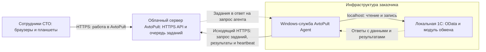

# AvtoPult — агент интеграции с 1С

Небольшая Windows-служба для обмена между облачным AvtoPult и 1С заказчика. Агент сам подключается к AvtoPult по HTTPS, забирает задания, обращается к 1С и возвращает результаты. Для соединения агента с облаком не нужны входящие порты, статический публичный IP или собственный HTTPS-сертификат на стороне заказчика.

## Как устроен обмен

Агент устанавливается локально на том же Windows-сервере, где опубликованы API 1С:



1. Сотрудник работает в AvtoPult; сервер ставит задания обмена в очередь.
2. Агент сам обращается к облачному API и получает очередное задание в ответе на свой запрос. Облако не открывает входящее соединение к заказчику.
3. Агент читает данные через OData, передаёт разрешённую команду записи модулю 1С или запускает оплату на локальном Smart POS.
4. Результат сохраняется локально и отправляется в AvtoPult. Агент также забирает из локального outbox 1С события и PDF-счета. При сбое связи доставка повторяется.

**HTTPS-сертификат устанавливается на стороне облачного AvtoPult** для его публичного домена. Агент проверяет этот сертификат как обычный HTTPS-клиент; статический публичный IP и собственный сертификат заказчику для этого не нужны. Связь агента с 1С остаётся внутри сервера и идёт через `http://127.0.0.1` с явным разрешением локального HTTP.

**Radmin VPN в рабочую схему не входит:** агент и 1С находятся на одном сервере и обмениваются данными локально. Radmin может использоваться специалистами только для удалённого администрирования и не влияет на работу интеграции.

## Что делает

- Читает опубликованные коллекции OData (каталог, цены, остатки и другие разрешённые данные).
- Передаёт создание/изменение заказов, запросы счетов и закрытые расчётные периоды в серверный модуль `/hs/avtopult/v1/`.
- Забирает из локального outbox 1С события и PDF-счета, подтверждая удаление только после приёма облаком.
- При настроенном Kaspi Smart POS запускает оплату по Kaspi QR или банковской карте через локальный HTTPS терминала и передаёт в AvtoPult подтверждённый результат.
- Делит большие OData-ответы на проверяемые части, сохраняет неотправленные данные локально и повторяет доставку после восстановления связи; отправляет heartbeat для мониторинга.

Пакет включает исходники каркаса расширения 1С, контракт адаптера, инструкцию передачи специалисту и матрицу приёмки. Готового универсального `.cfe` нет: привязка к объектам конкретной конфигурации 1С, сборка, установка и сквозная проверка выполняются на целевой базе.

## Защита и границы

- **По умолчанию только чтение.** Запись требует явного `ONE_C_ALLOW_WRITES=1`; до включения проверьте её на копии базы.
- Нет входящего сервера, SQL, выполнения команд ОС или произвольных команд из облака. Агент принимает только типизированные команды протокола и обращается только к настроенным адресам 1С, облака и Smart POS; HTTP-переадресации запрещены.
- Облако — только HTTPS. Локальный HTTP включается отдельно и передаёт данные/пароли без TLS: используйте localhost либо HTTPS для LAN.
- Раздельные пользователи 1С: OData — только чтение нужных объектов, запись — минимальные права. Ограничения доступа задаются **в 1С**, не названием пользователя.
- Секреты остаются в защищённом файле Windows; агент не пишет тела запросов и пароли в свои диагностические логи. Очередь содержит данные заказчика — её тоже нельзя публиковать или отправлять в поддержку без очистки.
- Размер ответов, число страниц и время HTTP-запросов ограничены. Это не заменяет нагрузочный тест и контроль места на диске.
- Один процесс владеет каталогом состояния через runtime lock. Очереди записываются атомарно в две проверяемые копии и восстанавливаются после оборванной записи.

Для эксплуатации используются резервные копии, минимальные права, отдельный секрет интеграции и один экземпляр службы на каталог состояния. Модуль 1С должен атомарно сохранять результат операции и её ключ идемпотентности: повтор команды после потерянного ответа возвращает сохранённый результат без повторного изменения данных. Остановка службы прекращает получение новых заданий, но не отменяет уже выполненные операции.

## Запуск и обслуживание

[Установка и конфигурация](INSTALL.md). Сначала копия базы и режим чтения; затем приёмка записи, повторов, обрыва связи и перезагрузки Windows. Установщик использует SYSTEM: защищайте каталоги агента и Node.js от записи обычными пользователями. До этой приёмки не считать установку боевой.

Для команды (Node.js 22.20+ ветки 22, npm 11.6.1):

```sh
npm ci
npm run check
```

Автономный пакет: `.artifacts/one-c-agent/`. Он содержит службу, PowerShell-скрипты, исходники расширения 1С, контракт API и контрольные суммы. CI проверяет Linux и Windows; контрольные суммы обнаруживают повреждение, но не заменяют доверенный источник пакета.

Основа агента — AvtoPult, ревизия `b7f3227c012d7f20b281ef8d4cbeef2a85bb7d93`. Из ревизии `730135e1043dea61acfa008a39aa02fce74c650c` перенесены изменения протокола `1.0`: поля идентичности и правил строк заказа, проверка итоговой `workOrderVersion` в ответе облака и её передача в ACK 1С, а также связанные тесты. Сохранены автономные настройки установки, запрет записи без разрешения администратора и совместимость отправки PDF.

Каталог `one-c-extension-source` полностью синхронизирован с исходниками расширения этой ревизии `730135e1043dea61acfa008a39aa02fce74c650c`. Это исходники для сборки и приёмки специалистом 1С, а не подтверждение исполнения на целевой базе. Схемы находятся в `src/protocol`; изменения контракта согласовываются и тестируются с backend. Синхронизация выполняется переносом исходников с сохранением автономных адаптаций; монорепозиторий и его история в этот репозиторий не перенесены.
