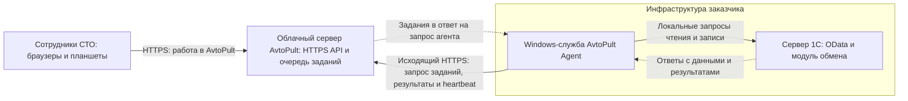

# AvtoPult — агент интеграции с 1С

Небольшая Windows-служба для обмена между облачным AvtoPult и 1С заказчика. Агент сам подключается к AvtoPult по HTTPS, забирает задания, обращается к 1С и возвращает результаты. Для соединения агента с облаком не нужны входящие порты, статический публичный IP или собственный HTTPS-сертификат на стороне заказчика.

## Как устроен обмен

Основная схема — агент на сервере 1С или в той же локальной сети:



1. Сотрудник работает в AvtoPult; сервер ставит задания обмена в очередь.
2. Агент сам обращается к облачному API и получает очередное задание в ответе на свой запрос. Облако не открывает входящее соединение к заказчику.
3. Агент читает данные через OData или передаёт разрешённую команду записи модулю 1С.
4. Результат сохраняется локально и отправляется в AvtoPult. При сбое связи агент повторяет доставку.

**HTTPS-сертификат устанавливается на стороне облачного AvtoPult** для его публичного домена. Агент проверяет этот сертификат как обычный HTTPS-клиент; статический публичный IP заказчику для этого не нужен. На одном сервере связь агента с 1С может идти по `http://127.0.0.1` с явным разрешением локального HTTP. Для HTTPS внутри LAN сертификат настраивается отдельно на публикации 1С, без необходимости публичного статического IP.

**Radmin зависит от места установки агента.** Если 1С доступна ему по localhost или обычной LAN, Radmin для обмена не требуется. Если агент установлен на промежуточной Windows-машине, которая видит 1С только через Radmin VPN, этот участок остаётся:

```text
Windows-агент → исходящий HTTPS → облачный AvtoPult
Windows-агент → Radmin VPN → сервер 1С
```

Для полного отказа от Radmin агент нужно разместить на сервере 1С или в сети с прямым локальным доступом к её API.

## Что делает

- Читает опубликованные коллекции OData (каталог, цены, остатки и другие разрешённые данные).
- Передаёт создание/изменение заказов и запросы счетов в серверный модуль `/hs/avtopult/v1/`.
- Сохраняет неотправленные результаты локально и повторяет доставку после восстановления связи; отправляет heartbeat для мониторинга.

Это транспорт, а не вся интеграция: агент не содержит бизнес-логику 1С, её расширение или готовый канал исходящих событий/PDF из 1С. Их установка и сквозная проверка выполняются отдельно.

## Защита и границы

- **По умолчанию только чтение.** Запись требует явного `ONE_C_ALLOW_WRITES=1`; до включения проверьте её на копии базы.
- Нет входящего сервера, SQL, выполнения команд ОС или произвольных команд из облака. Только три проверяемых типа заданий и настроенные адреса 1С; HTTP-переадресации запрещены.
- Облако — только HTTPS. Локальный HTTP включается отдельно и передаёт данные/пароли без TLS: используйте localhost либо HTTPS для LAN.
- Раздельные пользователи 1С: OData — только чтение нужных объектов, запись — минимальные права. Ограничения доступа задаются **в 1С**, не названием пользователя.
- Секреты остаются в защищённом файле Windows; агент не пишет тела запросов и пароли в свои диагностические логи. Очередь содержит данные заказчика — её тоже нельзя публиковать или отправлять в поддержку без очистки.
- Размер ответов, число страниц и время HTTP-запросов ограничены. Это не заменяет нагрузочный тест и контроль места на диске.

Для эксплуатации используются резервные копии, минимальные права, отдельный секрет интеграции и один экземпляр службы на каталог состояния. Модуль 1С должен атомарно сохранять результат операции и её ключ идемпотентности: повтор команды после потерянного ответа возвращает сохранённый результат без повторного изменения данных. Остановка службы прекращает получение новых заданий, но не отменяет уже выполненные операции.

## Запуск и обслуживание

[Установка и конфигурация](INSTALL.md). Сначала копия базы и режим чтения; затем приёмка записи, повторов, обрыва связи и перезагрузки Windows. Установщик использует SYSTEM: защищайте каталоги агента и Node.js от записи обычными пользователями. До этой приёмки не считать установку боевой.

Для команды (Node.js 22.20+ ветки 22, npm 11.6.1):

```sh
npm ci
npm run check
```

Автономный пакет: `.artifacts/one-c-agent/`. CI проверяет Linux и Windows; контрольные суммы обнаруживают повреждение, но не заменяют доверенный источник пакета.

Протокол `1.0` выделен из AvtoPult, ревизия `4c47386c82454cc4f376dba6bd2c79fff5267cf5`. Схемы находятся в `src/protocol`; изменения контракта согласовываются и тестируются с backend. Монорепозиторий и его история в этот репозиторий не перенесены.
